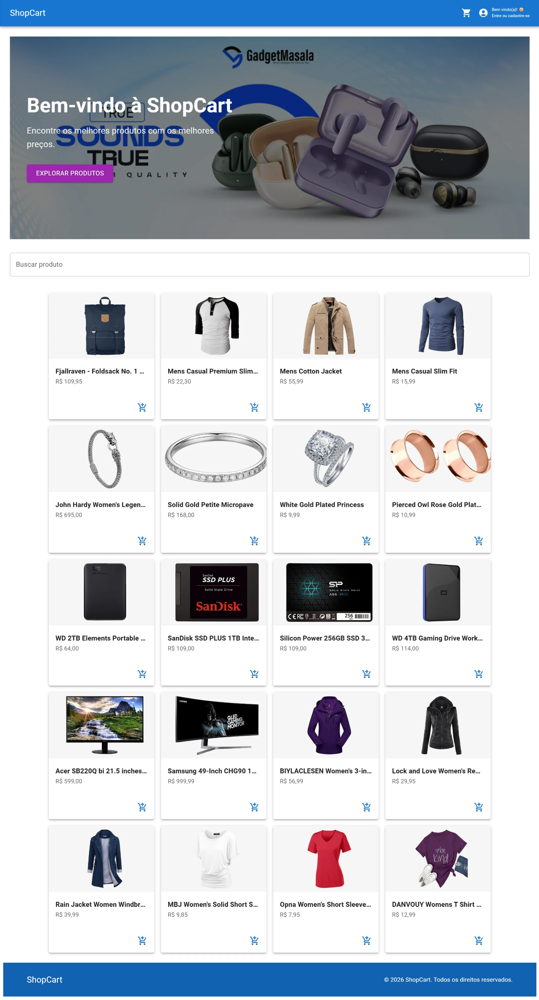

# 🛒 ShopCart - E-commerce em React

Aplicação de e-commerce desenvolvida com React, como proposta prática do curso de React ofertado pela Unifel.

O projeto simula uma loja virtual completa, com listagem de produtos, carrinho de compras, autenticação de usuários e fluxo de checkout.

---

## 🚀 Tecnologias utilizadas

- React
- React Router DOM
- Material UI (MUI)
- Vite
- Context API

---

## 📦 Funcionalidades

### 🏠 Home

- Listagem de produtos consumidos de API fake
- Busca de produtos por nome
- Hero section com destaque visual

### 🛍️ Carrinho

- Adicionar produtos ao carrinho
- Incrementar e decrementar quantidade
- Remover itens
- Cálculo automático do total
- Drawer lateral responsivo

### 🔐 Autenticação (Mock)

- Login de usuário
- Cadastro de usuário
- Controle de sessão com Context API

### 🧾 Checkout

- Rota protegida (apenas usuários logados)
- Redirecionamento automático para login
- Retorno automático ao checkout após autenticação

### 📄 Produto

- Página de detalhes do produto
- Layout responsivo e organizado

---

## 🧠 Arquitetura do projeto

O projeto segue uma estrutura baseada em **feature-based architecture**, separando responsabilidades por domínio:

```
src/
    Layout/
      Header.jsx
      Footer.jsx

  context/
    AuthContext.jsx
    CartContext.jsx

  features/
    home/
    product/
    cart/
    auth/
    checkout/

  routes/
    PrivateRoute.jsx

  utils/
    formatCurrency.js

  assets/
```

---

## 🔐 Controle de acesso

- Implementado com `PrivateRoute`
- Usuários não autenticados são redirecionados para login
- Após login, o usuário retorna automaticamente para a rota desejada

---

## 💡 Boas práticas aplicadas

- Separação de responsabilidades
- Componentização reutilizável
- Context API para estado global
- Layout responsivo com Material UI
- Controle de rotas com React Router
- Estrutura escalável para crescimento do projeto

---

## ▶️ Como rodar o projeto

```bash
# Clonar repositório
git clone https://github.com/seu-usuario/shopcart-react.git

# Acessar pasta
cd shopcart-react

# Instalar dependências
npm install

# Rodar o projeto
npm run dev
```

---

## 📸 Preview


<div align="center">
    
</div>
<br />
<div align="center">
    
</div>

## 📚 Sobre o projeto

Este projeto foi desenvolvido como parte do curso de React oferecido pela Unifel, com o objetivo de aplicar na prática conceitos fundamentais como:

- Componentização
- Gerenciamento de estado
- Navegação entre páginas
- Integração com APIs
- Boas práticas de desenvolvimento front-end

---

## 🚀 Melhorias futuras

- Integração com backend real
- Persistência de dados (localStorage ou API)
- Sistema de pagamento
- Validação de formulários
- Testes automatizados
- Deploy em produção

---

## 👨‍💻 Autor

Desenvolvido por Evandro
Projeto educacional - Curso de React Unifel

---

## 📄 Licença

Este projeto é de uso educacional e não possui fins comerciais.
